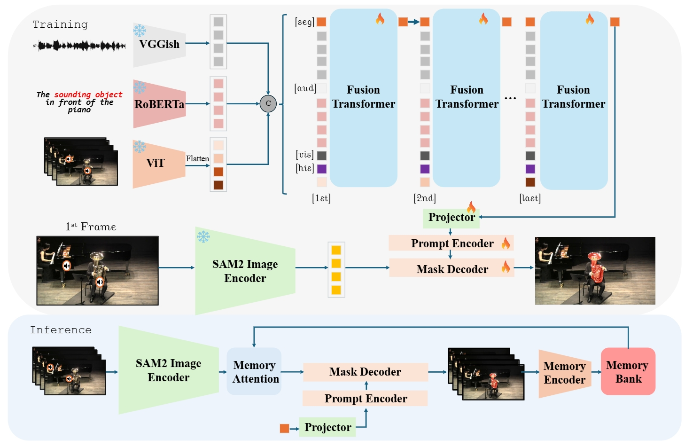
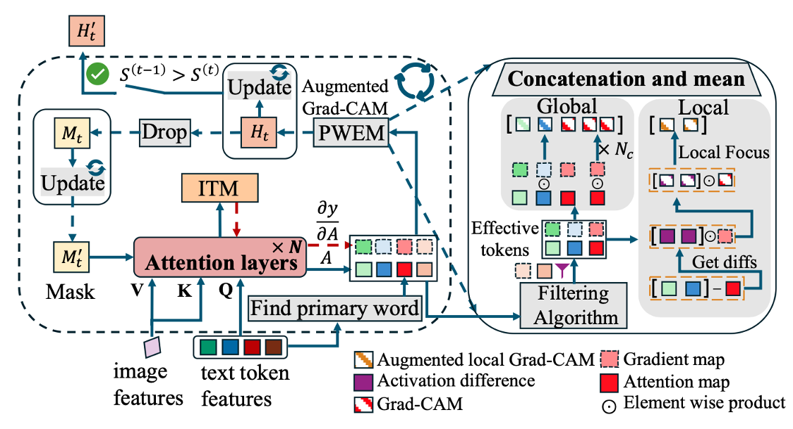
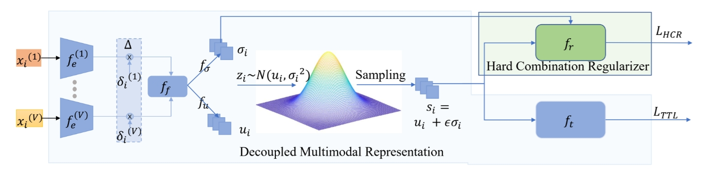

I am a first-year master student at Shenzhen International Graduate School, Tsinghua University. I am fortunate to be supervised by Prof. [Yansong Tang](https://andytang15.github.io/) in IVG@SZ group. Before that, I got B.S. in Electric and Electronic Engineering from the University of Electronic and Science Technology of China (UESTC) in 2024.

My research interests lie in Computer Vision, such as Multimodal Learning,Segmentation, Tracking.

[Email](mailto: yuji-wan24@mails.tsinghua.edu.cn) / [Google Schoolar](https://scholar.google.com/citations?hl=en&user=oRpCyGkAAAAJ)

---
# ✨ News
---
* 2025-02: One paper on Triple Modalality Referring Segmentation is accepted to [CVPR 2025](https://cvpr.thecvf.com/)
* 2024-12: One paper on Referring Image Segmentation is accepted to [AAAI 2025](https://aaai.org/conference/aaai/aaai-25/)
* 2024-07: One paper on Multimodal Learning is accepted to [ECCV 2024](https://eccv.ecva.net/)
<!-- * 2023-03: One paper on video understanding (Action Quality Assessment) is accepted to [CVPR 2023](https://cvpr.thecvf.com/Conferences/2023) -->

---
# 🔬 Research
---
* indicates equal contribution
<table style="width:100%;border:0px;border-spacing:0px;border-collapse:separate;margin-right:auto;margin-left:auto;"><tbody>	

  <!--SAM2LOVE-->
  <tr>
    <td style="padding:20px;width:30%;max-width:30%" align="center">
      
    </td>
    <td width="75%" valign="center">
      <papertitle> 	SAM2-LOVE: Segment Anything Model 2 in Language-aided Audio-Visual Scenes</papertitle>
       
      <b>Yuji Wang*</b>, Haoran Xu*, Yong Liu, Jiaze Li, Yansong Tang 
       
      <em>IEEE/CVF Conference on Computer Vision and Pattern Recognition (<strong>CVPR</strong>)</em>, 2025
      <!--  
      <a href="https://arxiv.org/abs/2505.03730">[PDF]</a>
      <a href="https://github.com/shiyi-zh0408/FlexiAct">[Project Page]</a> 
        -->
      
 We propose a novel framework called SAM2-LOVE to effectively segment the video objects referred by the audio and text and achieve significant improvement in Ref-AVS tasks.

    </td>
  </tr>	

  <!--IterPRime-->
  <tr>
    <td style="padding:20px;width:30%;max-width:30%" align="center">
      
    </td>
    <td width="75%" valign="center">
      <papertitle>IteRPrimE: Zero-shot Referring Image Segmentation with Iterative Grad-CAM Refinement and Primary Word Emphasis</papertitle>
       
      <b>Yuji Wang*</b>, Jingchen Ni*, Yong Liu, Chun Yuan, Yansong Tang 
       
      AAAI Conference on Artificial Intelligence (<strong>AAAI</strong>),2025
       
      <a href="https://ojs.aaai.org/index.php/AAAI/article/view/32880">[PDF]</a>
      <a href="https://github.com/VoyageWang/IteRPrimE">[Project Page]</a> 
       
      
 We propose the novel IteRPrimE network to leverage the Grad-CAM for zero-shot referring image segmentation, which addresses the previous CLIP-based methods' low robustness of positional phrases.

    </td>
  </tr>	

  <!--DMRNET-->
  <tr>
    <td style="padding:20px;width:30%;max-width:30%" align="center">
      
    </td>
    <td width="75%" valign="center">
      <papertitle>Robust Multimodal Learning via Representation Decoupling</papertitle>
       
      Shicai Wei, Yang Luo, <b>Yuji Wang</b>, Chunbo Luo
       
      <em>IEEE/CVF Conference on Computer Vision and Pattern Recognition (<strong>CVPR</strong>)</em>, 2024
       
      <a href="https://arxiv.org/pdf/2407.04458">[PDF]</a>
      <a href="https://github.com/shicaiwei123/ECCV2024-DMRNet">[Project Page]</a> 
       
      
 We propose DMRNet improves multimodal learning with missing modalities by modeling inputs as probabilistic distributions to capture modality-specific information, outperforming state-of-the-art methods.

    </td>
  </tr>	

</tbody></table>

---
# 🏆 Selected Honors and Awards
---
* **National Scholarship** for Undergraduate Students, 2022.12, 2023.12
* First-Class Academic Scholarship, UESTC 2021.12, 2022.12, 2023.12
* Outstanding Graduate, UESTC, 2024.06
* Outstanding Graduation Thesis, UESTC, 2024.06
* First-Class Honor Degree, UESTC, 2024.06

---
# 👥 Visitors
---

